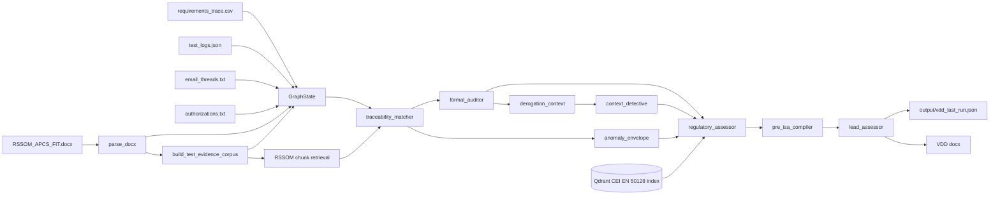
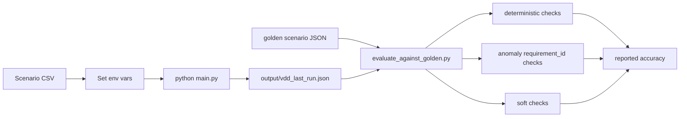

# Pipeline Overview

This document explains the full Hitachi evaluation pipeline, including:

- runtime flow
- where RSSOM, emails, logs, and `requirements_trace.csv` are used
- where RAG is actually used
- how eval accuracy is computed

## High-Level Runtime Flow



## What Each Input Means

### `RSSOM_APCS_FIT.docx`
- Main long-form test-design evidence source.
- Parsed into:
  - paragraphs
  - headings
  - tables
  - flattened full text
- Used in two main ways:
  1. to build the traceability corpus
  2. to feed the auditor with RSSOM/FIT content

### `requirements_trace.csv`
- Declared requirement list for the run.
- Contains:
  - `requirement_id`
  - `title`
  - `verification_status`
- This is not the evidence itself.
- It is the set of claims the pipeline checks against RSSOM/log evidence.

### `test_logs.json`
- Structured execution results.
- Gives the matcher another evidence source besides the RSSOM text.

### `email_threads.txt`
- Communications / governance context.
- Used by:
  - `derogation_context`
  - `context_detective`

### `authorizations.txt`
- Formal waiver / approval / authorization archive.
- Used together with emails for derogation scanning.

## Step-by-Step Node Logic

### 1. `parse_docx`
- Reads `data/RSSOM_APCS_FIT.docx`
- Produces structured `ParsedDocx`

### 2. `build_test_evidence_corpus`
- Builds one long searchable corpus from RSSOM text and tables
- This corpus is used by the matcher
- It still supports direct deterministic line-local lookup
- It is now also chunked and embedded at runtime for semantic retrieval fallback over RSSOM

### 3. `traceability_matcher`
- Compares:
  - `requirements_trace.csv`
  - RSSOM-derived corpus
  - `test_logs.json`
- Uses two document-evidence modes:
  1. exact line-local lookup by `requirement_id`
  2. RSSOM semantic retrieval fallback over chunked FIT evidence
- Produces:
  - `matcher_report`
  - anomalies
  - anomaly severities
  - requirement-linked evidence snippets
  - per-requirement RSSOM RAG hits

### 4. `anomaly_envelope`
- Deterministic summary of Phase 2 matcher output
- Builds:
  - `primary_requirement_ids`
  - `human_summary`
  - `retrieval_query`
  - `phase2_fingerprint`
- This is the handoff from traceability into the regulatory retrieval path

### 5. `formal_auditor`
- LLM-based auditor over RSSOM/FIT excerpt
- Produces:
  - compliance score
  - requirements found
  - risks
  - recommendations

### 6. `derogation_context`
- Deterministic scan of emails and authorizations
- Looks near matcher-linked requirement IDs / anomaly context
- Produces:
  - `derogation_report`
  - justification signals
  - governance snippets

### 7. `context_detective`
- LLM triage on:
  - matcher summary
  - derogation summary
  - emails
- Produces communications risk / suspiciousness output

### 8. `regulatory_assessor`
- Runs deterministic CEI EN 50128 rule checks
- Also performs regulatory clause retrieval
- Produces:
  - `regulatory_report`
  - findings
  - retrieved clauses

### 9. `pre_isa_compiler`
- Deterministically consolidates:
  - matcher
  - derogation
  - auditor
  - detective
  - regulatory
- Produces:
  - `pre_isa_report`
  - summary for VDD
  - evidence-chain explanation
  - per-anomaly verdicts

### 10. `lead_assessor`
- Final release decision layer
- Produces:
  - `assessor_report`
  - GO / NO-GO
  - final rationale

## Where RAG Exists

There are now two RAG-like evidence paths:

### A. RSSOM retrieval for traceability
- Built from the RSSOM/FIT corpus at runtime
- The corpus is chunked, embedded, and searched semantically
- Used by matcher as a fallback when exact line-local ID evidence is weak or missing
- Retrieval target:
  - chunked RSSOM / FIT evidence

### B. Regulatory clause retrieval
- This is the regulation-side RAG path
- Query comes from:
  - `anomaly_envelope.retrieval_query`
  - fallback: anomaly text
- Retrieval target:
  - CEI EN 50128 clause index in Qdrant
- Used inside:
  - `regulatory_assessor`

So, in short:

- RSSOM -> long evidence corpus -> matcher exact scan + RSSOM semantic retrieval fallback + auditor
- anomaly_envelope -> retrieval_query -> Qdrant regulatory index -> regulatory RAG

## Runtime Outputs

### `output/vdd_last_run.json`
- Frozen audit artifact for one run
- Main file used for eval comparison

### VDD docx
- Human-readable Word draft
- Built from consolidated outputs

## How Accuracy Is Computed

Accuracy in this project is **not classic ML classification accuracy**.

It is the agreement between:

1. a frozen pipeline run artifact
2. a frozen golden scenario file

### Process



## What `evaluate_against_golden.py` Checks

### `expected_deterministic`
Examples:
- `matcher_report.status`
- `pre_isa_report.overall`

These are the main pass/fail checks.

### `anomaly_requirement_id_checks`
Examples:
- must include `HIT-FAKE-999`
- must not include `HIT-FAKE-999`

This ensures exact anomaly behavior for each scenario.

### `expected_soft`
Examples:
- `assessor_report.final_decision`

These are often LLM-sensitive and usually treated as informative unless strict mode is enabled.

## Practical Meaning of Accuracy

The practical accuracy number is:

`correct deterministic checks + correct anomaly-id checks`
divided by
`total deterministic checks + total anomaly-id checks`

Soft checks are usually reported separately.

## Scenario Structure

Under `data/eval/`:

- `scenarios/` contains controlled input CSVs
- `golden/` contains expected outputs

Examples:

- `scenario_a_hit_fake.csv`
- `scenario_b_no_hit_fake.csv`
- `scenario_c_extra_conflict_row.csv`
- `baseline_legacy_trace.csv`

## Typical Commands

### Run one eval scenario

```bash
export VDD_AUDIT=1
export REQUIREMENTS_TRACE_CSV=data/eval/scenarios/scenario_b_no_hit_fake.csv
python main.py
python scripts/evaluate_against_golden.py \
  --audit output/vdd_last_run.json \
  --golden data/eval/golden/scenario_b.json
```

### Run baseline

```bash
export VDD_AUDIT=1
export REQUIREMENTS_TRACE_CSV=data/eval/scenarios/baseline_legacy_trace.csv
python main.py
python scripts/evaluate_against_golden.py \
  --audit output/vdd_last_run.json \
  --golden data/eval/golden/scenario_baseline.json
```

## Short Explanation for a Mentor

The pipeline takes:

- RSSOM as long-form evidence
- a requirement trace CSV as the declared claim set
- test logs as structured evidence
- emails and authorizations as governance context

It first checks traceability deterministically, then summarizes anomalies, then uses those anomalies to retrieve relevant CEI EN 50128 clauses via RAG, and finally consolidates everything into a pre-ISA report and release decision.

Its eval "accuracy" is the match rate between the generated audit JSON and golden expectations, mainly on deterministic fields and exact anomaly IDs.
